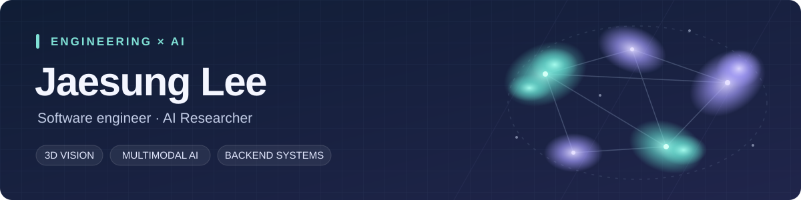

  

<h1 align="center">Hi, I'm Jaesung 👋</h1>

  <strong>Computer vision researcher · Software engineer</strong> 
  Language-grounded 3D scenes, reliable vision-language models, and backend services.

  
  
  

### ⚡ A few quick facts

- 🔬 **Currently:** Contract Researcher at **Auto-ID Labs Korea, KAIST** · September 2026–Present.
- 🎓 **Education:** M.S. in Computer Science, KAIST · completed August 2026.
- 🌐 **Research:** 3D Gaussian Splatting, visual grounding, and vision-language model evaluation.
- 🛠️ **Previously:** developed and operated backend services at **Tanker** and **XenoImpact**.
- 🧑‍🏫 **Teaching:** Python, deep learning, and LLM prompting at KAIST IT Academy.

---

### 🔬 Selected research

| Research | Venue & role | What the work explores |
| :--- | :--- | :--- |
| **ClusterSplat** | **NeurIPS 2026 · Spotlight** (accepted) **First-author research** | Language-conditioned semantic cluster selection for objects in 3D Gaussian Splatting scenes and their 2D masks. |
| **RADBench** | **IEEE IV 2026** Collaborative research | Evaluating foundation vision-language models on descriptions of autonomous-driving corner cases. |
| **DashBench** | **BMVC 2026** (accepted) Collaborative research | Evaluating video-language models' risk understanding and hallucinations in difficult driving scenarios. |

**My work on ClusterSplat** spans problem definition, model design, implementation, evaluation, and training optimization. **My contributions to RADBench** include evaluation pipelines, hallucination mitigation, and failure analysis.

<strong>📚 Full paper titles</strong>

- *ClusterSplat: Semantic Cluster Selection for 3D Visual Grounding in Gaussian Splatting*
- *RADBench: Evaluating Foundation VLMs for Corner Case Description on A Comprehensive Dataset*
- *Evaluating Video LLMs' Understanding of Corner Cases in Autonomous Driving* (DashBench)

### 🛠️ Engineering

**Asynchronous backend services · Tanker** 
Separated API requests from long-running workers with **RabbitMQ**, used **Redis** caching and **PostgreSQL**, and automated **AWS ECS** deployment with **GitHub Actions**. Integrated **pytest** into CI and modularized **Terraform**.

**LLM-assisted legacy code migration · XenoImpact** 
Participated in **COBOL-to-Java** migration, contributing to generated-code checks, builds, and error reporting.

### 🚀 Tools I use

**Research & model evaluation**

**Backend, infrastructure & testing**

<strong>🗂️ Experience & education</strong>

| Experience | Role | Period |
| :--- | :--- | :--- |
| **KAIST · Auto-ID Labs Korea** | Contract Researcher | September 2026–Present |
| **XenoImpact** | Software Engineer | September 2023–May 2024 |
| **Tanker** | Software Engineer | March 2020–September 2023 |
| **TEEware** | Android Development Intern | July–August 2018 |

- **KAIST · M.S. in Computer Science** — September 2024–August 2026.
- **KAIST · B.S. in Computer Science, minor in Chemistry** — March 2016–August 2024.

---

Research in 3D vision. Experience building and operating backend services.

